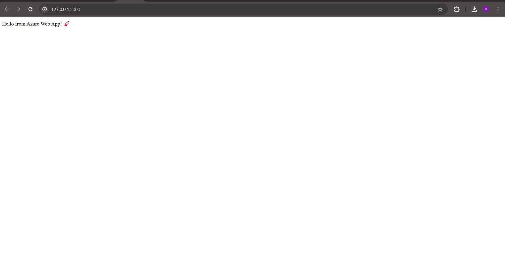

---

## ⚠️ Deployment Limitation Note

Due to **Azure subscription quota limits**, the App Service Plan (F1/B1) could not be provisioned in the available regions.  
This prevented the actual deployment of the Web App and SQL Database in the cloud.

However, this repository contains the **full end-to-end implementation**:

- ✅ Local Flask app tested successfully (`127.0.0.1:5000`)  
- ✅ Infrastructure scripts (`infra/deploy.sh`, `infra/sql-schema.sql`)  
- ✅ CI/CD pipeline with GitHub Actions (`.github/workflows/azure-deploy.yml`)  
- ✅ Documentation (`README.md`) with setup, verification, and automation steps  

## 🖼️ Screenshot (Local Run)
Below is the output of running the Flask app locally:

This demonstrates the **design, configuration, and automation process** required by the project, even though live deployment was blocked by subscription limitations.
